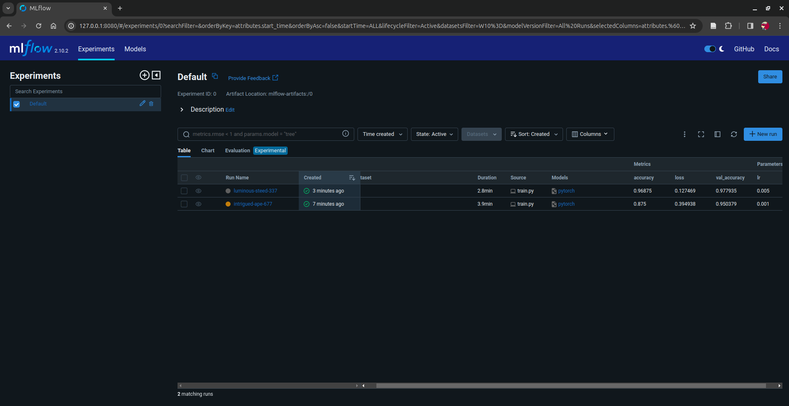
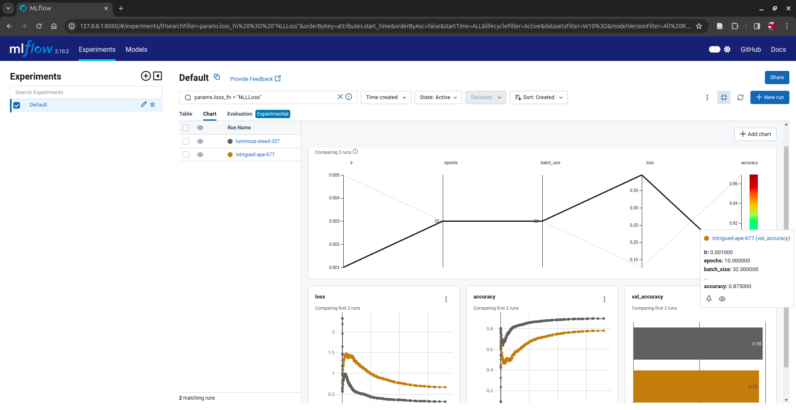

# pytorch-template


PyTorch template with experiment tracking (using MLFlow)

## Setup

- Initialize virtual environment

```bash
cd pytorch-template
python3 -m venv venv
source ./venv/bin/activate
```

- Install requirements

```bash
pip install -r requirements.txt
```

- Run training script (To modify the dataset or model check model.py and setup_data.py)

```bash
python train.py
```

## Screenshots

